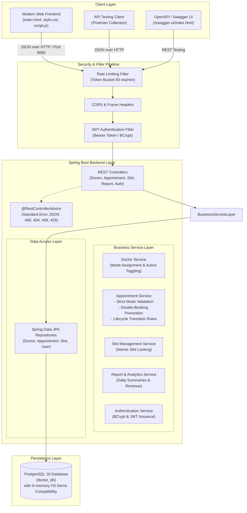
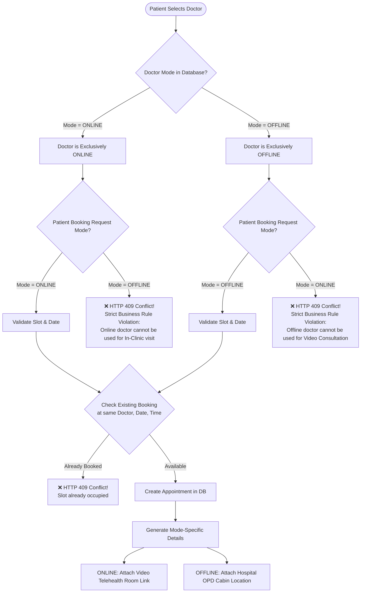
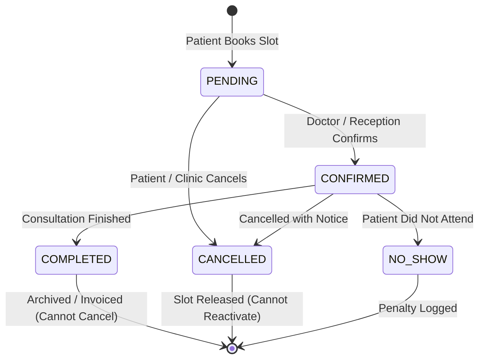

# System Architecture & Technical Specifications

**Project Name:** Doctor Appointment Management System — Secure Online & Offline Medical Appointment Booking Platform  
**Target Event:** College Project Expo 2026  
**Use Case:** Use Case 2 — Multi-Mode Medical Consultation with Strict Doctor Separation  

---

## 1. System Architecture Diagram



---

## 2. Strict Online / Offline Doctor Separation Rule



---

## 3. Database Entity Relationship (ER) Diagram

```mermaid
erDiagram
    DOCTORS ||--o{ APPOINTMENTS : "assigned to"
    DOCTORS ||--o{ SLOTS : "opens"
    SLOTS |o--o| APPOINTMENTS : "reserves"
    
    DOCTORS {
        bigint id PK
        varchar name
        varchar specialty
        varchar mode "ONLINE | OFFLINE (Strict)"
        varchar email UK
        varchar phone
        double precision consultation_fee
        varchar availability
        varchar clinic_address
        varchar meeting_platform
        boolean active
        timestamp created_at
    }

    APPOINTMENTS {
        bigint id PK
        varchar patient_name
        varchar patient_email
        varchar patient_phone
        bigint doctor_id FK
        varchar doctor_name
        varchar specialty
        varchar mode "ONLINE | OFFLINE"
        date appointment_date
        varchar appointment_time
        text reason
        varchar status "PENDING | CONFIRMED | COMPLETED | CANCELLED | NO_SHOW"
        double precision consultation_fee
        varchar meeting_link
        varchar clinic_address
        bigint slot_id FK
        timestamp created_at
        timestamp updated_at
    }

    SLOTS {
        bigint id PK
        bigint doctor_id FK
        varchar doctor_name
        date date
        varchar start_time
        varchar end_time
        varchar mode "ONLINE | OFFLINE"
        boolean available
    }

    USERS {
        bigint id PK
        varchar username UK
        varchar password "BCrypt Encrypted"
        varchar email UK
        varchar role "ROLE_PATIENT | ROLE_DOCTOR | ROLE_ADMIN"
        boolean enabled
    }
```

---

## 4. Appointment Status Lifecycle State Machine



---

## 5. Summary & Revenue Calculation Flow

```
Total Revenue = SUM(consultation_fee) WHERE status != 'CANCELLED'
Online Revenue = SUM(consultation_fee) WHERE mode = 'ONLINE' AND status != 'CANCELLED'
Offline Revenue = SUM(consultation_fee) WHERE mode = 'OFFLINE' AND status != 'CANCELLED'

Mode Ratio = (Online Appointments / Total Active Appointments) * 100
Specialty Breakdown = COUNT(*) GROUP BY specialty
```
